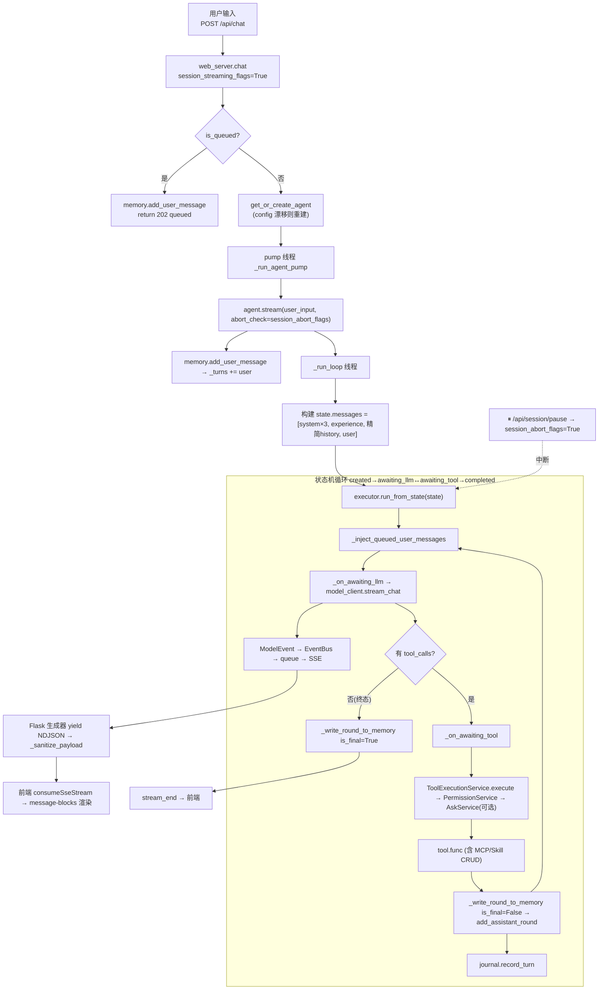

# FloodMind 架构总览（知识图谱）v2

> **更新日期**: 2026-07-04
> **变更摘要**: 自 v1 (2026-06) 以来完成 MCP 统一 (A/B/C)、Skill 统一 (A/B/C/D)、C-core/C-deep (AgentTool↔ToolSpec 收敛)、记忆子系统收敛 (批次 A/B)、死代码清理 (批次 E)。
> 详细评估（已完成 vs 剩余）见 [`ASSESSMENT.md`](./ASSESSMENT.md)。

## 1. 系统定位

FloodMind 是一个**中文水文预报 AI Agent**：用户用自然语言下达预报任务，Agent 规划→调用工具/技能（读数据、跑模型、出图、写报告）→交付产物。底层是自研 native agent runtime（已移除 LangChain），上层是 Flask + React。

## 2. 进程拓扑

```
┌──────────────────────────────────────────────────────────────────────┐
│  floodmind serve / web  →  web_server.py (Flask, :13014)             │
│  ├─ SessionManager（agent 实例 + 会话元数据）                         │
│  ├─ session_states / session_*_flags（运行时配置 + 流控标志）          │
│  ├─ 每个 /api/chat 起一个 pump 线程跑 agent.stream() → SSE/NDJSON      │
│  └─ 服务 web/dist（React 构建产物，非 vite dev）                      │
├──────────────────────────────────────────────────────────────────────┤
│  scheduler.py（独立轮询进程 / 或 web 内线程）                         │
│  └─ 到点 claim_due_tasks → get_or_create_agent → agent.run()（非流式） │
├──────────────────────────────────────────────────────────────────────┤
│  floodmind chat / tui  →  simple_tui.py（进程内直接 agent.stream()）   │
└──────────────────────────────────────────────────────────────────────┘
                       ↕ 共享磁盘 ↕
  data/sessions/<sid>/{memory/chat_history.json, outputs/, uploads/, journal/, checkpoints/, trace.jsonl, session.json}
  data/scheduled_tasks.json   data/task_experience/tree_index.json
  ~/.config/floodmind/sessions.db（sync_events 回放 + FTS5）
  ~/.floodmind/{settings.json, SOUL.md, mcp.json, AGENTS.md}
```

## 3. 六大子系统（更新后）

| 子系统 | 位置 | 职责 | **v2 变更** |
|---|---|---|---|
| **Agent 执行核心** | `floodmind/agent/native/` | 状态机 executor + NativeFloodAgent（prompt 分层、工具注册、MCP/Skill 管理、委派、流式） | 新增 MCP 管理工具 (3 个)、Skill CRUD 工具 (5 个)、移除 dead agent 子包 |
| **Runtime 服务** | `floodmind/agent/runtime/{contracts,services,adapters}/` | 工具执行/权限/询问/路径/检查点/日志/追踪/沙箱/工作区 | 无重大变更 |
| **记忆与会话** | `floodmind/memory/` | DualMemory（扁平 _turns）+ SessionManager + session_store(SQLite) + task_experience | 删除 SimpleMemory、遗留压缩子系统 (b)；memory 检索接口收敛 |
| **工具与技能** | `floodmind/tools/` + `floodmind/skills/` | AgentTool↔ToolSpec 双抽象 + SkillRegistry 单例 + SkillCurator 生命周期 | **重写**: AgentTool.to_tool_spec() 唯一转换点；SkillRegistry 替代双 registry；Curator 整合 |
| **MCP 集成** | `floodmind/agent/mcp_client.py` | McpClientPool 单例 + build_mcp_tool_specs + 生命周期原语 | **重写**: 连接/注册解耦；list/disconnect 原语；Agent 工具暴露 |
| **Web 后端** | `web_server.py` + `cli.py` + `tui/` + `scheduler.py` | 路由、流式管线、脱敏、CLI、TUI、调度 | P0 修复（前端序列化、streaming flag、排队逻辑） |
| **Web 前端** | `web/src/` | React SPA：useChatStream（SSE 消费）、消息块渲染、权限/产物 | 死组件清理（NotFound/CheckboxGroup/resumeSession） |

## 4. 核心调用图（一次用户轮次，更新后）



## 5. 状态机 (NativeAgentExecutor)

```
created → awaiting_llm ──┐
                          │ (有 tool_calls)
   ↑                      ↓
   │              awaiting_tool ──┐
   │                              │ (awaiting_permission)
   │                              ↓
   │                       awaiting_permission
   │                              │ (approved/denied)
   └──────────────────────────────┘
 awaiting_llm ──(无 tool_calls / max_iter)──→ completed
 任意状态 ──(abort_check)──→ failed   (= 用户暂停)
 context_compress ←→ awaiting_llm    (context 比例超阈值)
```

## 6. 数据流：用户输入 → 产物

1. `memory.add_user_message` → `_turns += {role:user}`
2. `get_chat_history_for_system_prompt` → **精简上下文**（早期轮压缩摘要 + 近 6 条原文），注入 system 消息
3. LLM 流式产出 → EventBus → queue → 前端增量渲染
4. 工具调用经 `ToolExecutionService`（权限→校验→300s 线程）→ journal 归档
5. **整轮原子完成** → `add_assistant_round(content, reasoning, tool_calls, is_final)` → `_turns += {role:assistant}` + `save_chat_history`
6. 后台：task_experience 捕获 → 经验树 → 可能生成 skill（触发 `refresh_skills`）

## 7. 记忆分层

| 层 | 内容 | 用途 |
|---|---|---|
| **精简上下文** | 早期轮压缩摘要 + 近 6 条原文 | **常规 LLM 上下文**（唯一历史注入点） |
| **全量 _turns** | 扁平 user/assistant 条目 | 持久化 `chat_history.json`，供 MemorySearch 检索 |
| **journal** | turns.jsonl 摘要 + full_results/ | JournalSearch / JournalGetFullResult |
| **task_experience** | 经验树（跨会话） | ExperienceSearch + 注入摘要 + auto-gen skill |
| **core_memory.json** | 用户偏好/项目约束 | CoreMemoryRead/Append |

✅ 已删除遗留压缩子系统 (b)：`_short_term`/`_consolidate`/`_long_term`/`compressed_summary`。现仅两道压缩：`_turns` 压缩 + executor `ContextCompressor`。

## 8. MCP 集成架构（更新后）

```
┌─────────────────────────────────────────────────────────────────┐
│                  McpClientPool (全局单例)                        │
│                                                                 │
│  connect_server(config) → McpClientConnection                    │
│  disconnect_server(name) → bool                                  │
│  connections() → Dict[str, McpClientConnection]                  │
│  list_servers() → List[dict]                                     │
│  get_server_info(name) → dict                                    │
│  call_tool(full_name, kwargs) → result                           │
│                                                                 │
│  build_mcp_tool_specs(conn, name, call_tool_fn) → List[ToolSpec] │
│    ↑ MCP ToolSpec 唯一构造点（连接与注册解耦）                    │
└─────────────────────────────────────────────────────────────────┘
         ↕
┌─────────────────────────────────────────────────────────────────┐
│  NativeFloodAgent (MCP 管理工具，仅 orchestrator)                 │
│                                                                 │
│  LoadMcpServer(name, transport, url)                             │
│    → pool.connect_server → build_mcp_tool_specs                  │
│    → orchestrator_registry.register + specialist_registry        │
│                                                                 │
│  ListMcpServers() → pool.list_servers()                          │
│                                                                 │
│  DisconnectMcpServer(name)                                       │
│    → pool.disconnect_server                                      │
│    → unregister_prefix("mcp:{name}:") 双 registry 清理           │
└─────────────────────────────────────────────────────────────────┘
```

**设计原则**：系统运行状态下随时接入随时发现，不需要重启。连接与注册解耦，Agent 可自维护 MCP 服务。

## 9. Skill 体系统一架构（新）

```
┌─────────────────────────────────────────────────────────────────┐
│                SkillRegistry (全局单例)                           │
│                                                                 │
│  roots = [floodmind/skills/, PROJECT_ROOT/skills/,               │
│           PROJECT_ROOT/.claude/skills/]  ← CWD 无关, 包定位      │
│  writable_root = PROJECT_ROOT/skills  ← CreateSkill 落盘目标     │
│                                                                 │
│  _scan() → discover_skills_from_roots → _parse_skill_md          │
│         → 合并 ephemeral (编程式) → filter disabled              │
│         → generate_skill_catalog (单 catalog)                    │
│                                                                 │
│  refresh() → _scan + _notify_changed (清 GetSkill 缓存)         │
│  register_skill(skill) → 编程式注册 (去重)                       │
│  set_disabled(name, bool) → 禁用/启用 (内存标记)                 │
│  list_skills() / get_skill(name) / catalog()                     │
└──────────────┬──────────────────────────────────────────────────┘
               │
    ┌──────────┴──────────┐
    │                     │
    ▼                     ▼
┌──────────────┐  ┌──────────────────────────────────────┐
│ Agent CRUD   │  │ SkillCurator (单例)                   │
│              │  │                                      │
│ ListSkills   │  │ record_usage(name, success)          │
│ CreateSkill  │  │   ← GetSkill 每次调用自动触发         │
│ UpdateSkill  │  │                                      │
│ RemoveSkill  │  │ run_maintenance_if_needed()          │
│ RefreshSkills│  │   ← _init_tools 时调用 (6h 间隔)     │
│              │  │   → stale 标记 → 过期归档 → 重复检测  │
│              │  │                                      │
│ 全部 state_  │  │ archive_skill(name) → .archived/     │
│ write; 仅    │  │ restore_skill(name) → writable_root  │
│ orchestrator │  │ find_duplicates() → 相似度检测        │
└──────────────┘  └──────────────────────────────────────┘
```

**关键设计**：
- **单一发现源**：`SkillRegistry` 是唯一权威，替代旧双 registry（`skills.SKILL_REGISTRY` + `tools._SKILL_REGISTRY`）
- **热插拔闭环**：auto-gen 写 `writable_root` → 即发现 → `_on_skill_generated` 回调触发 `refresh_skills`
- **只归档不删除**：curator 只做 `shutil.move` 到 `.archived/`，可恢复
- **线程安全**：`SkillRegistry` 用 `threading.Lock`；`SkillCurator` 用 `threading.RLock`（支持 `run_maintenance` → `archive_skill` 重入）

## 10. 工具体系：AgentTool ↔ ToolSpec

```
编写层 (人编写)                    运行时层 (Agent 使用)
┌──────────────────┐              ┌──────────────────┐
│ AgentTool        │  to_tool_spec│ ToolSpec          │
│ (pydantic)       │──────────────→ (dataclass)       │
│                  │              │                  │
│ name, description│  native_from_│ name, description│
│ parameters, func │  agent_tool  │ parameters, func  │
│ is_readonly      │  (薄归一化)   │ permission_policy │
│ is_destructive   │              │ is_readonly      │
│ is_concurrency_  │              │ is_destructive   │
│ safe             │              │ is_concurrency_  │
│ validate_input_fn│              │ safe             │
│ permission_policy│              │                  │
└──────────────────┘              └──────────────────┘

         │                                │
         ▼                                ▼
┌──────────────────┐              ┌──────────────────────────┐
│ ToolRegistry     │              │ _InstanceToolRegistry    │
│ (全局, 编写时)    │              │ (每 Agent 实例, 运行时)   │
│                  │              │                          │
│ register(Agent   │              │ register(ToolSpec)       │
│   Tool)          │              │ unregister_prefix(pref)  │
│ get(name)        │              │ tools_schema() → OpenAI  │
└──────────────────┘              └──────────────────────────┘

MCP 工具: 直造 ToolSpec（业界标准协议，inputSchema 已是终点 JSON Schema）
```

**C-deep 收敛要点**：
- `AgentTool.to_tool_spec()` 是唯一转换点
- `native_from_agent_tool` 降为薄归一化层（ToolSpec 原样 / AgentTool 委托 to_tool_spec / 鸭子对象包成 AgentTool 再投影）
- 系统工具（plan/SubAgent/LoadMcpServer）统一用 AgentTool 编写
- MCP 保持直造 ToolSpec（非 LangChain 风格，不包 AgentTool）

## 11. 权限模型（三层闸门）

1. **SDK 钩子** `_permission_handler`（bare 模式）
2. **PermissionService.check**：policy_type (readonly/write/exec/ask/network/internal/state_write/skill_script) → 子代理分层白名单 → planning 模式硬门禁 write/exec/state_write/SubAgent/ParallelTask
3. **ToolSpec.check_permissions 兜底**

`ask` 策略 → AskService（`threading.Event` 阻塞）→ 前端 PermissionBanner → 用户批准/拒绝。

## 12. 持久化布局

```
data/sessions/<sid>/
  ├─ session.json                     SessionInfo
  ├─ memory/chat_history.json         ⭐ 对话历史（扁平 _turns）
  ├─ core_memory.json                 关键事实
  ├─ outputs/                         Agent 产物
  ├─ uploads/                         用户上传
  ├─ journal/{turns.jsonl, full_results/}
  ├─ checkpoints/<ckpt_id>/{state.json, files/}
  └─ trace.jsonl
data/scheduled_tasks.json
data/task_experience/tree_index.json
~/.config/floodmind/sessions.db       SQLite: sync_events + FTS5
~/.floodmind/{settings.json, SOUL.md, mcp.json, AGENTS.md, skill_curator.json}
skills/                               ⭐ Skill 写入根 (PROJECT_ROOT/skills)
  └─ .archived/                       归档 skill (curator)
  └─ <skill_name>/SKILL.md            CreateSkill 产出
```

## 13. 线程模型

- **Flask 请求线程**（waitress 8 / gunicorn 4）
- **pump 线程** `agent-pump-<sid>`：daemon，跑 `agent.stream()`
- **心跳线程** `heartbeat-<sid>`：每 8s
- **标题生成线程**：首条消息后异步 LLM
- **cleanup 线程**：SessionManager 后台清理
- 同步：`SkillRegistry._lock` (Lock)、`SkillCurator._lock` (RLock)、`McpClientPool._lock` (Lock)、`_InstanceToolRegistry._lock` (Lock)

## 14. 脱敏

`_sanitize_payload`（SSE 递归白名单）+ `sanitize_output`（路径→basename、内部 id→占位、移除注入块）+ `_sanitize_deep`。

## 15. 关键文件索引（更新后）

| 关注点 | 文件 |
|---|---|
| 状态机 | `floodmind/agent/native/executor.py` |
| Agent 主体 | `floodmind/agent/native/native_flood_agent.py` |
| LLM 流 | `floodmind/agent/native/model_client.py` |
| 事件总线 | `floodmind/agent/native/event_bus.py` |
| MCP 客户端池 | `floodmind/agent/mcp_client.py` |
| 工具桥 | `floodmind/agent/native/tool_runtime.py` |
| 工具编写 | `floodmind/tools/agent_tool.py` |
| 内置工具 | `floodmind/tools/base_tools.py` + `file_tools.py` + `memory_tools.py` |
| 工具执行闸门 | `floodmind/agent/runtime/services/tool_execution_service.py` |
| 权限 | `floodmind/agent/runtime/services/permission_service.py` |
| 询问 | `floodmind/agent/runtime/services/ask_service.py` |
| 沙箱 | `floodmind/agent/runtime/services/sandbox_service.py` + `process_sandbox.py` |
| 记忆 | `floodmind/memory/dual_memory.py` |
| 会话管理 | `floodmind/memory/session_manager.py` |
| 经验树 | `floodmind/memory/task_experience.py` + `experience_tree.py` |
| 技能发现 | `floodmind/skills/base.py` |
| ⭐ 技能注册表 | `floodmind/skills/registry.py` (单例 SkillRegistry) |
| ⭐ 技能策展 | `floodmind/skills/skill_curator.py` (SkillCurator + 巡检) |
| Web 集成 | `web_server.py` |
| 调度 | `scheduler.py` |
| 配置 | `floodmind/config/settings.py` |
| 前端 SSE | `web/src/features/chat/lib/{sse-reader,stream-events}.ts` |
| 前端消息块 | `web/src/features/chat/lib/message-blocks.ts` |
