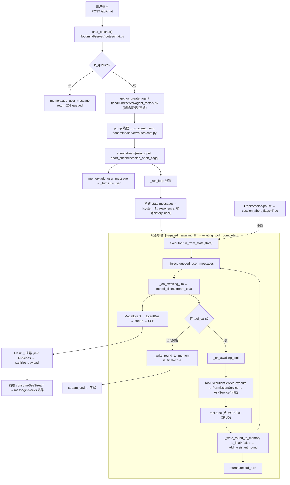

# FloodMind 架构总览（SDK-first）v4.1

> **更新日期**: 2026-08-06
> **变更摘要**: SDK v1.1.9；新增后台任务（`Bash run_in_background=True` + `BackgroundTaskService`，stdout/stderr 直写文件，TaskOutput/TaskList/TaskKill，executor 完成通知注入 user 消息，EventBus `background_task_completed` 空闲唤醒）；五项健壮性修复——① `exec_bash` 子进程关 stdin（`stdin=DEVNULL`，裸 python/交互命令不再挂起到超时）；② Bash 描述动态带 shell 类型（Windows=PowerShell 语法）+ 声明 stdin 已关；③ 完整模式注册宿主自定义 tools（此前被静默丢弃）；④ 完整模式保留宿主 system_prompt（热插拔重建不丢）；⑤ 未声明 permission_policy 回退 is_readonly（只读放行，不再一刀切 DENY）。v1.1.7 彻底修复 MiniMax `tool id not found (2013)` 三层叠加根因——① 流式 tool call 空 id 时历史 id 不一致（fallback id 写回 accumulator）；② `ContextCompressor` 机械切尾部拆散工具调用原子组留下孤儿 tool（现按原子组对齐切分 `_aligned_split_points`，head 至少保留首条 user）；③ `context_window` 误用全局默认模型窗口（现 `_resolve_context_window` 跟随注入模型 preset）。v1.1.6 移除 `SearchTools` 工具，工具发现与 skill 一致——`## 可用工具` 提示目录直接列出全部工具名称与基本描述，参数统一由 `GetTool` 查看并加载，模型无需搜索；移除工具输出静默字符截断（`_finalize_tool_output` 8000 字符上限 + journal 1000 字符内联阈值），模型始终看到完整工具结果，上下文由 token 级 `ContextCompressor` 兜底；`short_description` 剥离 `[必填]/[可选]` 参数提示前缀。v1.1.5 含四项健壮性/权限收敛：① `ToolExecutionService` 统一清洗工具调用参数键名（模型偶发畸形键如 `{"tool_name"": ...}` 不再 `**kwargs` 崩，改走正常执行/清晰校验反馈）；② exec 命令体写目标检查（`>`/`Set-Content`/`Copy-Item` 等越权写被 DENY，堵住"只读授权被 Bash 绕过"漏洞，`exec_write_scanner`）；③ folder-first 读白名单加入已装 skill 注册表（可直读 SKILL.md/references）；④ PathService 读取拒绝原因附可操作引导。v1.1.4 含 create() 连接阶段 LLM 流式重试；v1.1.3 含 mid-stream 断流重试关键词；v1.1.2 含 CreateScheduledTask 描述修正 + 调度 workspace unknown 修复。
> 详细评估见 [`ASSESSMENT.md`](./ASSESSMENT.md)；CC 风格文件管理差距与改造方案见 [`CC_FILE_MANAGEMENT_GAP_ANALYSIS.md`](./CC_FILE_MANAGEMENT_GAP_ANALYSIS.md)。

## 1. 系统定位

FloodMind 是一个 **SDK-first 中文水文预报 AI Agent Runtime**：宿主系统通过 Python SDK 创建 `Agent`，注入 `ModelClient`、业务工具、Skill/MCP 能力和 `Workspace`，由 Agent 完成规划→调用工具/技能（读数据、跑模型、出图、写报告）→交付产物。Web/TUI 代码仅作为 legacy adapter 保留；新平台、桌面助手或服务端集成应直接嵌入 SDK。

## 2. 进程拓扑

```
┌──────────────────────────────────────────────────────────────────────┐
│  Python 宿主 / Desktop Assistant / Platform Service / floodmind run   │
│                                                                      │
│  from floodmind import Agent, ModelClient, Workspace, build_agent_tool │
│    ├─ ModelClient → ProviderPipeline（厂商方言/流式 reasoning/usage）  │
│    ├─ Workspace(folder_first) → <workspace>/.floodmind/*              │
│    ├─ custom tools / MCP ToolSpec / Skill                             │
│    └─ Agent.run() / Agent.stream() → 事件协议                         │
└──────────────────────────────┬───────────────────────────────────────┘
                               │
┌──────────────────────────────▼───────────────────────────────────────┐
│  NativeFloodAgent（advanced runtime，被 Agent SDK 封装）               │
│    ├─ NativeAgentExecutor 状态机                                      │
│    ├─ ToolExecutionService / PathService / PermissionService          │
│    ├─ DualMemory / Journal / Checkpoint / Trace                       │
│    ├─ SkillRegistry / SkillCurator                                    │
│    └─ McpClientPool                                                   │
└──────────────────────────────┬───────────────────────────────────────┘
                               │
        folder-first: <workspace>/.floodmind/{sessions,artifacts,tmp,scripts,sandboxes}
        web legacy:   data/sessions/<sid>/{outputs,uploads,memory,journal,checkpoints,trace}

Legacy adapter（迁移期保留，不属于 SDK 核心依赖）:
  floodmind/server/ + web_server.py + web/React
  floodmind/tui/ Textual
```

## 3. 六大子系统（更新后）

| 子系统 | 位置 | 职责 | **v2 变更** |
|---|---|---|---|
| **SDK API** | `floodmind/__init__.py`, `floodmind/agent/api.py` | 顶层公共入口：`Agent` / `ModelClient` / `Workspace` / `build_agent_tool` / Provider Pipeline / MCP helpers | SDK-first 主入口；base install 不依赖 Web/TUI |
| **Agent 执行核心** | `floodmind/agent/native/` | 状态机 executor + NativeFloodAgent（prompt 分层、工具注册、MCP/Skill 管理、委派、流式） | `Agent` 封装普通用法；`NativeFloodAgent` 为 advanced runtime |
| **Runtime 服务** | `floodmind/agent/runtime/{contracts,services,adapters}/` | 工具执行/权限/询问/路径/检查点/日志/追踪/沙箱/工作区 | Harness 级 Workspace；folder-first cwd-first 路径解析；`.floodmind` 收纳；Checkpoint state-only，不复制 workspace 文件 |
| **记忆与会话** | `floodmind/memory/` | DualMemory（扁平 _turns）+ SessionManager + session_store(SQLite) + task_experience | 删除 SimpleMemory、遗留压缩子系统 (b)；SessionManager 新增 git worktree 会话隔离 (create/remove/fork) |
| **工具与技能** | `floodmind/tools/` + `floodmind/skills/` + `contrib/` | AgentTool↔ToolSpec 双抽象 + SkillRegistry 单例 + SkillCurator 生命周期 | **重写**: AgentTool.to_tool_spec() 唯一转换点；SkillRegistry 替代双 registry；Curator 整合；chronos 迁至 contrib/ |
| **MCP 集成** | `floodmind/agent/mcp_client.py` | McpClientPool 单例 + build_mcp_tool_specs + 生命周期原语 | **重写**: 连接/注册解耦；list/disconnect 原语；Agent 工具暴露 |
| **Legacy Web Adapter** | `web_server.py` + `floodmind/server/` + `web/` | 旧 HTTP/React 适配层 | 迁移期保留；SDK 核心不得依赖 |
| **Legacy TUI Adapter** | `floodmind/tui/` | 旧 Textual 终端界面 | 迁移期保留；命令行入口仅输出 legacy 提示 |

## 4. 核心调用图（一次用户轮次，更新后）


```mermaid
flowchart TD
  U["用户输入<br/>POST /api/chat"] --> CHAT["chat_bp.chat()<br/>floodmind/server/routes/chat.py"]
  CHAT --> QC{is_queued?}
  QC -- 是 --> Q["memory.add_user_message<br/>return 202 queued"]
  QC -- 否 --> AF["get_or_create_agent<br/>floodmind/server/agent_factory.py<br/>(配置漂移则重建)"]
  AF --> PUMP["pump 线程 _run_agent_pump<br/>floodmind/server/routes/chat.py"]
  PUMP --> ST["agent.stream(user_input, abort_check=session_abort_flags)"]
  ST --> AUM["memory.add_user_message → _turns += user"]
  ST --> RLC["_run_loop 线程"]
  RLC --> BUILD["构建 state.messages = [system×N, experience, 精简history, user]"]
  BUILD --> EXEC["executor.run_from_state(state)"]

  subgraph LOOP["状态机循环 created→awaiting_llm↔awaiting_tool→completed"]
    EXEC --> INJ["_inject_queued_user_messages"]
    INJ --> LLM["_on_awaiting_llm → model_client.stream_chat"]
    LLM --> EVT["ModelEvent → EventBus → queue → SSE"]
    LLM --> TC{有 tool_calls?}
    TC -- 否(终态) --> WR1["_write_round_to_memory is_final=True"]
    TC -- 是 --> AT["_on_awaiting_tool"]
    AT --> PERM["ToolExecutionService.execute → PermissionService → AskService(可选)"]
    PERM --> TOOL["tool.func (含 MCP/Skill CRUD)"]
    TOOL --> WR2["_write_round_to_memory is_final=False → add_assistant_round"]
    WR2 --> JOURNAL["journal.record_turn"]
    WR2 --> INJ
  end

  EVT --> SSE["Flask 生成器 yield NDJSON → sanitize_payload"]
  SSE --> FE["前端 consumeSseStream → message-blocks 渲染"]
  WR1 --> DONE["stream_end → 前端"]
  ABORT["⏸ /api/session/pause → session_abort_flags=True"] -.中断.-> EXEC
```

## 5. 状态机 (NativeAgentExecutor)

```
created → awaiting_llm ──┐
                          │ (有 tool_calls)
   ↑                      ↓
   │              awaiting_tool ──┐
   │                              │ (awaiting_permission)
   │                              ↓
   │                       awaiting_permission
   │                              │ (approved/denied)
   └──────────────────────────────┘
 awaiting_llm ──(无 tool_calls / max_iter)──→ completed
 任意状态 ──(abort_check)──→ failed   (= 用户暂停)
 context_compress ←→ awaiting_llm    (context 比例超阈值)
```

## 6. 数据流：用户输入 → 产物

1. `memory.add_user_message` → `_turns += {role:user}`
2. `get_chat_history_for_system_prompt` → **精简上下文**（早期轮压缩摘要 + 近 6 条原文），注入 system 消息
3. LLM 流式产出 → EventBus → queue → 前端增量渲染
4. 工具调用经 `ToolExecutionService`（权限→校验→300s 线程）→ journal 归档
5. **整轮原子完成** → `add_assistant_round(content, reasoning, tool_calls, is_final)` → `_turns += {role:assistant}` + `save_chat_history`
6. 后台：task_experience 捕获 → 经验树 → 可能生成 skill（触发 `refresh_skills`）

## 7. 记忆分层

| 层 | 内容 | 用途 |
|---|---|---|
| **精简上下文** | 早期轮压缩摘要 + 近 6 条原文 | **常规 LLM 上下文**（唯一历史注入点） |
| **全量 _turns** | 扁平 user/assistant 条目 | 持久化 `chat_history.json`，供 MemorySearch 检索 |
| **journal** | turns.jsonl 摘要 + full_results/ | JournalSearch / JournalGetFullResult |
| **task_experience** | 经验树（跨会话） | ExperienceSearch + 注入摘要 + auto-gen skill |
| **core_memory.json** | 用户偏好/项目约束 | CoreMemoryRead/Append |

✅ 已删除遗留压缩子系统 (b)：`_short_term`/`_consolidate`/`_long_term`/`compressed_summary`。现仅两道压缩：`_turns` 压缩 + executor `ContextCompressor`。

## 8. MCP 集成架构（更新后）

```
┌─────────────────────────────────────────────────────────────────┐
│                  McpClientPool (全局单例)                        │
│                                                                 │
│  connect_server(config) → McpClientConnection                    │
│  disconnect_server(name) → bool                                  │
│  connections() → Dict[str, McpClientConnection]                  │
│  list_servers() → List[dict]                                     │
│  get_server_info(name) → dict                                    │
│  call_tool(full_name, kwargs) → result                           │
│                                                                 │
│  build_mcp_tool_specs(conn, name, call_tool_fn) → List[ToolSpec] │
│    ↑ MCP ToolSpec 唯一构造点（连接与注册解耦）                    │
└─────────────────────────────────────────────────────────────────┘
         ↕
┌─────────────────────────────────────────────────────────────────┐
│  NativeFloodAgent (MCP 管理工具，仅 orchestrator)                 │
│                                                                 │
│  LoadMcpServer(name, transport, url)                             │
│    → pool.connect_server → build_mcp_tool_specs                  │
│    → orchestrator_registry.register + specialist_registry        │
│                                                                 │
│  ListMcpServers() → pool.list_servers()                          │
│                                                                 │
│  DisconnectMcpServer(name)                                       │
│    → pool.disconnect_server                                      │
│    → unregister_prefix("mcp:{name}:") 双 registry 清理           │
└─────────────────────────────────────────────────────────────────┘
```

**设计原则**：系统运行状态下随时接入随时发现，不需要重启。连接与注册解耦，Agent 可自维护 MCP 服务。

## 9. Skill 体系统一架构（新）

```
┌─────────────────────────────────────────────────────────────────┐
│                SkillRegistry (全局单例)                           │
│                                                                 │
│  roots = [floodmind/skills/, PROJECT_ROOT/skills/,               │
│           PROJECT_ROOT/.claude/skills/]  ← CWD 无关, 包定位      │
│  writable_root = PROJECT_ROOT/skills  ← CreateSkill 落盘目标     │
│                                                                 │
│  _scan() → discover_skills_from_roots → _parse_skill_md          │
│         → 合并 ephemeral (编程式) → filter disabled              │
│         → generate_skill_catalog (单 catalog)                    │
│                                                                 │
│  refresh() → _scan + _notify_changed (清 GetSkill 缓存)         │
│  register_skill(skill) → 编程式注册 (去重)                       │
│  set_disabled(name, bool) → 禁用/启用 (内存标记)                 │
│  list_skills() / get_skill(name) / catalog()                     │
└──────────────┬──────────────────────────────────────────────────┘
               │
    ┌──────────┴──────────┐
    │                     │
    ▼                     ▼
┌──────────────┐  ┌──────────────────────────────────────┐
│ Agent CRUD   │  │ SkillCurator (单例)                   │
│              │  │                                      │
│ ListSkills   │  │ record_usage(name, success)          │
│ CreateSkill  │  │   ← GetSkill 每次调用自动触发         │
│ UpdateSkill  │  │                                      │
│ RemoveSkill  │  │ run_maintenance_if_needed()          │
│ RefreshSkills│  │   ← _init_tools 时调用 (6h 间隔)     │
│              │  │   → stale 标记 → 过期归档 → 重复检测  │
│              │  │                                      │
│ 全部 state_  │  │ archive_skill(name) → .archived/     │
│ write; 仅    │  │ restore_skill(name) → writable_root  │
│ orchestrator │  │ find_duplicates() → 相似度检测        │
└──────────────┘  └──────────────────────────────────────┘
```

**关键设计**：
- **单一发现源**：`SkillRegistry` 是唯一权威，替代旧双 registry（`skills.SKILL_REGISTRY` + `tools._SKILL_REGISTRY`）
- **热插拔闭环**：auto-gen 写 `writable_root` → 即发现 → `_on_skill_generated` 回调触发 `refresh_skills`
- **只归档不删除**：curator 只做 `shutil.move` 到 `.archived/`，可恢复
- **线程安全**：`SkillRegistry` 用 `threading.Lock`；`SkillCurator` 用 `threading.RLock`（支持 `run_maintenance` → `archive_skill` 重入）

## 10. 工具体系：AgentTool ↔ ToolSpec

```
编写层 (人编写)                    运行时层 (Agent 使用)
┌──────────────────┐              ┌──────────────────┐
│ AgentTool        │  to_tool_spec│ ToolSpec          │
│ (pydantic)       │──────────────→ (dataclass)       │
│                  │              │                  │
│ name, description│  native_from_│ name, description│
│ parameters, func │  agent_tool  │ parameters, func  │
│ is_readonly      │  (薄归一化)   │ permission_policy │
│ is_destructive   │              │ is_readonly      │
│ is_concurrency_  │              │ is_destructive   │
│ safe             │              │ is_concurrency_  │
│ validate_input_fn│              │ safe             │
│ permission_policy│              │                  │
└──────────────────┘              └──────────────────┘

         │                                │
         ▼                                ▼
┌──────────────────┐              ┌──────────────────────────┐
│ ToolRegistry     │              │ _InstanceToolRegistry    │
│ (全局, 编写时)    │              │ (每 Agent 实例, 运行时)   │
│                  │              │                          │
│ register(Agent   │              │ register(ToolSpec)       │
│   Tool)          │              │ unregister_prefix(pref)  │
│ get(name)        │              │ tools_schema() → OpenAI  │
└──────────────────┘              └──────────────────────────┘

MCP 工具: 直造 ToolSpec（业界标准协议，inputSchema 已是终点 JSON Schema）
```

**C-deep 收敛要点**：
- `AgentTool.to_tool_spec()` 是唯一转换点
- `native_from_agent_tool` 降为薄归一化层（ToolSpec 原样 / AgentTool 委托 to_tool_spec / 鸭子对象包成 AgentTool 再投影）
- 系统工具（plan/SubAgent/LoadMcpServer）统一用 AgentTool 编写
- MCP 保持直造 ToolSpec（非 LangChain 风格，不包 AgentTool）

## 11. 权限模型（三层闸门）

1. **SDK 钩子** `_permission_handler`（bare 模式）
2. **PermissionService.check**：policy_type (readonly/write/exec/ask/network/internal/state_write/skill_script) → 子代理分层白名单 → planning 模式硬门禁 write/exec/state_write/SubAgent/ParallelTask
3. **ToolSpec.check_permissions 兜底**

`ask` 策略 → AskService（`threading.Event` 阻塞）→ 前端 PermissionBanner → 用户批准/拒绝。

## 12. 持久化布局

```
data/sessions/<sid>/
  ├─ session.json                     SessionInfo
  ├─ memory/chat_history.json         ⭐ 对话历史（扁平 _turns）
  ├─ core_memory.json                 关键事实
  ├─ outputs/                         Agent 产物
  ├─ uploads/                         用户上传
  ├─ journal/{turns.jsonl, full_results/}
  ├─ checkpoints/<ckpt_id>/{state.json, manifest.json}   # state-only，不含 files/ 快照
  └─ trace.jsonl
data/worktrees/<sid>-<branch>/         git worktree 会话隔离 (SessionManager)
data/scheduled_tasks.json
data/task_experience/tree_index.json
~/.floodmind/{settings.json, SOUL.md, mcp.json, AGENTS.md, skill_curator.json}
skills/                               ⭐ Skill 写入根 (PROJECT_ROOT/skills)
  └─ .archived/                       归档 skill (curator)
  └─ <skill_name>/SKILL.md            CreateSkill 产出
contrib/                              chronos 等已外置为 MCP 服务的脚本（迁移出 floodmind/skills/）
```

Checkpoint 在 v1.1.9 中只保存 Agent runtime state：`state.json` 是 `AgentLoopState` 序列化，`manifest.json` 记录 checkpoint 元数据和父 checkpoint 链。它不复制 workspace 文件，也不承担文件回滚职责；产物通过 artifact/journal 记录引用，文件版本化或回滚如需支持应由独立 change journal / artifact versioning 能力承担。

## 13. 线程模型

- **Flask 请求线程**（waitress 8 / gunicorn 4）
- **pump 线程** `agent-pump-<sid>`：daemon，跑 `_run_agent_pump`（`floodmind/server/routes/chat.py`）
- **agent 子线程** `_run_loop`：`copy_context().run()`，SDK 内部跑 executor 状态机
- **心跳线程** `heartbeat-<sid>`：每 8s
- **标题生成线程**：首条消息后异步 LLM（`floodmind/server/routes/chat.py`）
- **cleanup 线程**：SessionManager 后台清理
- 同步锁：`SkillRegistry._lock` (Lock)、`SkillCurator._lock` (RLock)、`McpClientPool._lock` (Lock)、`_InstanceToolRegistry._lock` (Lock)、`session_streaming_lock` (Lock)、`session_abort_flags_lock` (Lock)

## 14. 脱敏

`_sanitize_payload`（SSE 递归白名单）+ `sanitize_output`（路径→basename、内部 id→占位、移除注入块）+ `_sanitize_deep`。

## 15. 关键文件索引（更新后）

| 关注点 | 文件 |
|---|---|
| 状态机 | `floodmind/agent/native/executor.py` |
| Agent 主体 | `floodmind/agent/native/native_flood_agent.py` |
| LLM 流 | `floodmind/agent/native/model_client.py` |
| 事件总线 | `floodmind/agent/native/event_bus.py` |
| MCP 客户端池 | `floodmind/agent/mcp_client.py` |
| 工具桥 | `floodmind/agent/native/tool_runtime.py` |
| 工具编写 | `floodmind/tools/agent_tool.py` |
| 内置工具 | `floodmind/tools/base_tools.py` + `file_tools.py` + `memory_tools.py` |
| 工具执行闸门 | `floodmind/agent/runtime/services/tool_execution_service.py` |
| 权限 | `floodmind/agent/runtime/services/permission_service.py` |
| 询问 | `floodmind/agent/runtime/services/ask_service.py` |
| 沙箱 | `floodmind/agent/runtime/services/sandbox_service.py` + `process_sandbox.py` |
| 记忆 | `floodmind/memory/dual_memory.py` |
| 会话管理 | `floodmind/memory/session_manager.py` |
| 经验树 | `floodmind/memory/task_experience.py` + `experience_tree.py` |
| 技能发现 | `floodmind/skills/base.py` |
| ⭐ 技能注册表 | `floodmind/skills/registry.py` (单例 SkillRegistry) |
| ⭐ 技能策展 | `floodmind/skills/skill_curator.py` (SkillCurator + 巡检) |
| Web 入口 | `web_server.py`（legacy Flask 入口；core package 不依赖） |
| Web 路由 | `floodmind/server/routes/{chat,sessions,files,models,memory,permission,checkpoints,tasks}.py` |
| Web Agent 工厂 | `floodmind/server/agent_factory.py` (get_or_create_agent) |
| Web 运行时状态 | `floodmind/server/session_state.py` (流控/中断标志/token 用量) |
| Web 脱敏 | `floodmind/server/sanitize.py` |
| Web 文件工具 | `floodmind/server/file_utils.py` (产物提取/预览) |
| 调度 | `scheduler.py` |
| 配置 | `floodmind/config/settings.py` |
| 嵌入式 SDK 入口 | `floodmind/agent/api.py` (Agent 类 → bare=True) |
| 前端 SSE | `web/src/features/chat/lib/{sse-reader,stream-events}.ts` |
| 前端消息块 | `web/src/features/chat/lib/message-blocks.ts` |
| 外置脚本 | `contrib/{chronos,hydro_case_client,validate_skill_methods}.py` |
