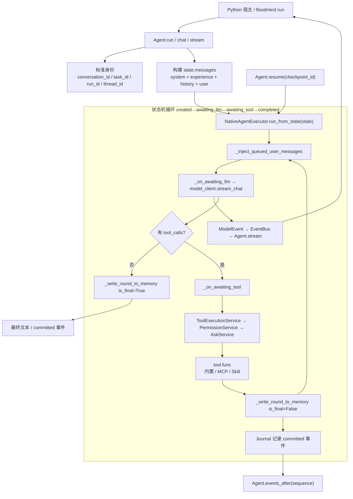

# FloodMind 架构总览（SDK-first）v4.2

> **更新日期**: 2026-08-11
> **变更摘要**: SDK v2.0.0；发布宿主项目 Skill roots：`Agent(skill_roots=[...], skill_writable_root=...)` 与公共 `agent.skill_registry`。Agent runtime 使用每实例独立 Registry + Curator，隔离 bound GetSkill cache、Curator、TaskExperience 及状态路径；默认全局 `get_skill_registry/register_skill` 仅保留兼容旧行为与历史状态路径。Skill 优先级固定为内置 > 宿主 > 项目 > `.claude` > ephemeral；显式根规范化为 CWD 无关绝对路径，workspace 不等于 Skill roots 且不会被隐式扫描。roots 在 runtime 只读，普通 Write/Edit/Bash 不获写权；CRUD 仅操作 writable source，并拒绝 builtin/readonly/ephemeral Update/Remove，执行 symlink/containment 检查。bare/full 均提供 catalog + GetSkill；full 仅向 orchestrator 增加 CRUD，specialist 只有 GetSkill。顶层导出 `SkillRegistry` / `SkillRoot` / `create_skill_registry`；LS_Agent 可通过显式 roots 部署 SKILL.md，本仓库不修改 LS_Agent。完整回归：**1154 passed, 1 skipped**（skipped = Linux Landlock 平台测试，Windows 环境跳过）。
> 详细评估见 [`ASSESSMENT.md`](./ASSESSMENT.md)；CC 风格文件管理差距与改造方案见 [`CC_FILE_MANAGEMENT_GAP_ANALYSIS.md`](./CC_FILE_MANAGEMENT_GAP_ANALYSIS.md)。

## 1. 系统定位

FloodMind 是一个 **SDK-first 中文水文预报 AI Agent Runtime**：宿主系统通过 Python SDK 创建 `Agent`，注入 `ModelClient`、业务工具、Skill/MCP 能力和 `Workspace`，由 Agent 完成规划→调用工具/技能（读数据、跑模型、出图、写报告）→交付产物。旧 Web/TUI 实现已在 v2.0.0 移除；新平台、桌面助手或服务端集成直接嵌入 SDK，命令行任务使用 `floodmind run`。

## 2. 进程拓扑

```
┌──────────────────────────────────────────────────────────────────────┐
│  Python 宿主 / Desktop Assistant / Platform Service / floodmind run   │
│                                                                      │
│  from floodmind import Agent, ModelClient, Workspace, build_agent_tool │
│    ├─ ModelClient → ProviderPipeline（厂商方言/流式 reasoning/usage）  │
│    ├─ Workspace(folder_first) → <workspace>/.floodmind/*              │
│    ├─ custom tools / MCP ToolSpec / Skill                             │
│    └─ Agent.run() / Agent.stream() → 事件协议                         │
└──────────────────────────────┬───────────────────────────────────────┘
                               │
┌──────────────────────────────▼───────────────────────────────────────┐
│  NativeFloodAgent（advanced runtime，被 Agent SDK 封装）               │
│    ├─ NativeAgentExecutor 状态机                                      │
│    ├─ ToolExecutionService / PathService / PermissionService          │
│    ├─ DualMemory / Journal / Checkpoint / Trace                       │
│    ├─ SkillRegistry / SkillCurator                                    │
│    └─ McpClientPool                                                   │
└──────────────────────────────┬───────────────────────────────────────┘
                               │
        folder-first: <workspace>/.floodmind/{sessions,artifacts,tmp,scripts,sandboxes}
```

v2.0.0 已移除旧 Web/TUI 进程与前端；集成边界统一为 Python SDK / `floodmind run`。

## 3. 六大子系统（更新后）

| 子系统 | 位置 | 职责 | **v2 变更** |
|---|---|---|---|
| **SDK API** | `floodmind/__init__.py`, `floodmind/agent/api.py` | 顶层公共入口：`Agent` / `ModelClient` / `Workspace` / `build_agent_tool` / Provider Pipeline / MCP helpers | SDK-first 主入口；base install 不依赖 Web/TUI |
| **Agent 执行核心** | `floodmind/agent/native/` | 状态机 executor + NativeFloodAgent（prompt 分层、工具注册、MCP/Skill 管理、委派、流式） | `Agent` 封装普通用法；`NativeFloodAgent` 为 advanced runtime |
| **Runtime 服务** | `floodmind/agent/runtime/{contracts,services,adapters}/` | 工具执行/权限/询问/路径/检查点/日志/追踪/沙箱/工作区 | Harness 级 Workspace；folder-first cwd-first 路径解析；`.floodmind` 收纳；Checkpoint state-only，不复制 workspace 文件 |
| **记忆与会话** | `floodmind/memory/` | DualMemory（扁平 _turns）+ SessionManager + task_experience | 删除 SimpleMemory、遗留压缩子系统 (b)；SessionManager 提供 git worktree 会话隔离 (create/remove/fork) |
| **工具与技能** | `floodmind/tools/` + `floodmind/skills/` + `contrib/` | AgentTool↔ToolSpec 双抽象 + 每 Agent SkillRegistry/SkillCurator + 默认全局兼容 API | Agent 实例隔离；宿主显式 roots；bound GetSkill；orchestrator-only CRUD；chronos 迁至 contrib/ |
| **MCP 集成** | `floodmind/agent/mcp_client.py` | McpClientPool 单例 + build_mcp_tool_specs + 生命周期原语 | **重写**: 连接/注册解耦；list/disconnect 原语；Agent 工具暴露 |

## 4. 核心调用图（一次用户轮次，更新后）


```mermaid
flowchart TD
  HOST["Python 宿主 / floodmind run"] --> API["Agent.run / chat / stream"]
  API --> ID["标准身份<br/>conversation_id / task_id / run_id / thread_id"]
  API --> BUILD["构建 state.messages<br/>system + experience + history + user"]
  BUILD --> EXEC["NativeAgentExecutor.run_from_state(state)"]

  subgraph LOOP["状态机循环 created→awaiting_llm↔awaiting_tool→completed"]
    EXEC --> INJ["_inject_queued_user_messages"]
    INJ --> LLM["_on_awaiting_llm → model_client.stream_chat"]
    LLM --> EVT["ModelEvent → EventBus → Agent.stream"]
    LLM --> TC{有 tool_calls?}
    TC -- 否 --> WR1["_write_round_to_memory is_final=True"]
    TC -- 是 --> AT["_on_awaiting_tool"]
    AT --> PERM["ToolExecutionService → PermissionService → AskService"]
    PERM --> TOOL["tool.func<br/>内置 / MCP / Skill"]
    TOOL --> WR2["_write_round_to_memory is_final=False"]
    WR2 --> JOURNAL["Journal 记录 committed 事件"]
    WR2 --> INJ
  end

  EVT --> HOST
  JOURNAL --> EVENTS["Agent.events_after(sequence)"]
  CHECKPOINT["Agent.resume(checkpoint_id)"] --> EXEC
  WR1 --> DONE["最终文本 / committed 事件"]
```

## 5. 状态机 (NativeAgentExecutor)

```
created → awaiting_llm ──┐
                          │ (有 tool_calls)
   ↑                      ↓
   │              awaiting_tool ──┐
   │                              │ (awaiting_permission)
   │                              ↓
   │                       awaiting_permission
   │                              │ (approved/denied)
   └──────────────────────────────┘
 awaiting_llm ──(无 tool_calls / max_iter)──→ completed
 任意状态 ──(abort_check)──→ failed   (= 用户暂停)
 context_compress ←→ awaiting_llm    (context 比例超阈值)
```

## 6. 数据流：用户输入 → 产物

1. `memory.add_user_message` → `_turns += {role:user}`
2. `get_chat_history_for_system_prompt` → **精简上下文**（早期轮压缩摘要 + 近 6 条原文），注入 system 消息
3. LLM 流式产出 → EventBus → `Agent.stream()` 结构化事件
4. 工具调用经 `ToolExecutionService`（权限→校验→执行）→ Journal 归档
5. **整轮原子完成** → `add_assistant_round(content, reasoning, tool_calls, is_final)` → `_turns += {role:assistant}` + `save_chat_history`
6. 后台：task_experience 捕获 → 经验树 → 可能生成 skill（触发 `refresh_skills`）

## 7. 记忆分层

| 层 | 内容 | 用途 |
|---|---|---|
| **精简上下文** | 早期轮压缩摘要 + 近 6 条原文 | **常规 LLM 上下文**（唯一历史注入点） |
| **全量 _turns** | 扁平 user/assistant 条目 | 持久化 `chat_history.json`，供 MemorySearch 检索 |
| **journal** | turns.jsonl 摘要 + full_results/ | JournalSearch / JournalGetFullResult |
| **task_experience** | 经验树（跨会话） | ExperienceSearch + 注入摘要 + auto-gen skill |
| **core_memory.json** | 用户偏好/项目约束 | CoreMemoryRead/Append |

✅ 已删除遗留压缩子系统 (b)：`_short_term`/`_consolidate`/`_long_term`/`compressed_summary`。现仅两道压缩：`_turns` 压缩 + executor `ContextCompressor`。

## 8. MCP 集成架构（更新后）

```
┌─────────────────────────────────────────────────────────────────┐
│                  McpClientPool (全局单例)                        │
│                                                                 │
│  connect_server(config) → McpClientConnection                    │
│  disconnect_server(name) → bool                                  │
│  connections() → Dict[str, McpClientConnection]                  │
│  list_servers() → List[dict]                                     │
│  get_server_info(name) → dict                                    │
│  call_tool(full_name, kwargs) → result                           │
│                                                                 │
│  build_mcp_tool_specs(conn, name, call_tool_fn) → List[ToolSpec] │
│    ↑ MCP ToolSpec 唯一构造点（连接与注册解耦）                    │
└─────────────────────────────────────────────────────────────────┘
         ↕
┌─────────────────────────────────────────────────────────────────┐
│  NativeFloodAgent (MCP 管理工具，仅 orchestrator)                 │
│                                                                 │
│  LoadMcpServer(name, transport, url)                             │
│    → pool.connect_server → build_mcp_tool_specs                  │
│    → orchestrator_registry.register + specialist_registry        │
│                                                                 │
│  ListMcpServers() → pool.list_servers()                          │
│                                                                 │
│  DisconnectMcpServer(name)                                       │
│    → pool.disconnect_server                                      │
│    → unregister_prefix("mcp:{name}:") 双 registry 清理           │
└─────────────────────────────────────────────────────────────────┘
```

**设计原则**：系统运行状态下随时接入随时发现，不需要重启。连接与注册解耦，Agent 可自维护 MCP 服务。

## 9. Skill 体系统一架构（v2.0.0）

```text
Agent(skill_roots=[...], skill_writable_root=...)
  ├─ SkillRegistry（每 Agent 独立；公开 agent.skill_registry）
  │    roots: builtin > host > project > .claude > ephemeral
  │    显式路径：构造时绝对化，CWD-independent
  │    workspace：不作为 Skill root，不隐式扫描
  │    catalog / ephemeral / refresh callbacks：实例隔离
  ├─ SkillCurator(registry=该实例)
  │    usage / stale / archive / duplicate / state path：实例隔离
  ├─ bound GetSkill
  │    bare + full 都可用；cache 由该 Registry refresh 单独清理
  └─ Skill CRUD
       仅 full orchestrator；specialist 无 CRUD
       仅 skill_writable_root；canonical/symlink/containment 校验
```

**权限与兼容边界**：

- roots 在 runtime 只获得读授权，普通 `Write` / `Edit` / `Bash` 不因此获得写权限；
- builtin、readonly root 与 ephemeral Skill 不能 Update/Remove；
- `TaskExperience` 的生成目标和状态路径绑定当前 Agent writable root；
- `get_skill_registry()` / `register_skill()` 继续使用历史默认全局 Registry 与原状态路径，仅服务旧 API；Agent runtime 不再使用全局 Skill 单例；
- 顶层公共导出：`SkillRegistry`、`SkillRoot`、`create_skill_registry`；
- LS_Agent 可部署 `SKILL.md` 后把目录作为显式 roots 注入，本仓库不修改 LS_Agent。

详细发现、消费、CRUD 和隔离数据流见 [`SKILL_ARCHITECTURE.md`](./SKILL_ARCHITECTURE.md)。

## 10. 工具体系：AgentTool ↔ ToolSpec

```
编写层 (人编写)                    运行时层 (Agent 使用)
┌──────────────────┐              ┌──────────────────┐
│ AgentTool        │  to_tool_spec│ ToolSpec          │
│ (pydantic)       │──────────────→ (dataclass)       │
│                  │              │                  │
│ name, description│  native_from_│ name, description│
│ parameters, func │  agent_tool  │ parameters, func  │
│ is_readonly      │  (薄归一化)   │ permission_policy │
│ is_destructive   │              │ is_readonly      │
│ is_concurrency_  │              │ is_destructive   │
│ safe             │              │ is_concurrency_  │
│ validate_input_fn│              │ safe             │
│ permission_policy│              │                  │
└──────────────────┘              └──────────────────┘

         │                                │
         ▼                                ▼
┌──────────────────┐              ┌──────────────────────────┐
│ ToolRegistry     │              │ _InstanceToolRegistry    │
│ (全局, 编写时)    │              │ (每 Agent 实例, 运行时)   │
│                  │              │                          │
│ register(Agent   │              │ register(ToolSpec)       │
│   Tool)          │              │ unregister_prefix(pref)  │
│ get(name)        │              │ tools_schema() → OpenAI  │
└──────────────────┘              └──────────────────────────┘

MCP 工具: 直造 ToolSpec（业界标准协议，inputSchema 已是终点 JSON Schema）
```

**C-deep 收敛要点**：
- `AgentTool.to_tool_spec()` 是唯一转换点
- `native_from_agent_tool` 降为薄归一化层（ToolSpec 原样 / AgentTool 委托 to_tool_spec / 鸭子对象包成 AgentTool 再投影）
- 系统工具（plan/SubAgent/LoadMcpServer）统一用 AgentTool 编写
- MCP 保持直造 ToolSpec（非 LangChain 风格，不包 AgentTool）

## 11. 权限模型（三层闸门）

1. **SDK 钩子** `_permission_handler`（bare 模式）
2. **PermissionService.check**：policy_type (readonly/write/exec/ask/network/internal/state_write/skill_script) → 子代理分层白名单 → planning 模式硬门禁 write/exec/state_write/SubAgent/ParallelTask
3. **ToolSpec.check_permissions 兜底**

`ask` 策略 → AskService（`threading.Event` 阻塞）→ 宿主通过 `permission_ask` 事件批准/拒绝。

## 12. 持久化布局

```
data/sessions/<sid>/
  ├─ session.json                     SessionInfo
  ├─ memory/chat_history.json         ⭐ 对话历史（扁平 _turns）
  ├─ core_memory.json                 关键事实
  ├─ outputs/                         Agent 产物
  ├─ uploads/                         用户上传
  ├─ journal/{turns.jsonl, full_results/}
  ├─ checkpoints/<ckpt_id>/{state.json, manifest.json}   # state-only，不含 files/ 快照
  └─ trace.jsonl
data/worktrees/<sid>-<branch>/         git worktree 会话隔离 (SessionManager)
data/scheduled_tasks.json
data/task_experience/tree_index.json
~/.floodmind/{settings.json, SOUL.md, mcp.json, AGENTS.md, skill_curator.json}
skills/                               ⭐ Skill 写入根 (PROJECT_ROOT/skills)
  └─ .archived/                       归档 skill (curator)
  └─ <skill_name>/SKILL.md            CreateSkill 产出
contrib/                              chronos 等已外置为 MCP 服务的脚本（迁移出 floodmind/skills/）
```

Checkpoint 自 v1.1.9 起只保存 Agent runtime state：`state.json` 是 `AgentLoopState` 序列化，`manifest.json` 记录 checkpoint 元数据和父 checkpoint 链。它不复制 workspace 文件，也不承担文件回滚职责；产物通过 artifact/journal 记录引用，文件版本化或回滚如需支持应由独立 change journal / artifact versioning 能力承担。

## 13. 并发与后台执行

- Agent 执行循环由 SDK 内部驱动，宿主通过 `run()` / `chat()` / `stream()` 调用。
- `ChildThreadRuntime` 提供子线程运行时与隔离上下文。
- `BackgroundTaskService` 托管后台进程、完成通知与进程树终止。
- `SandboxService` 与 `ArtifactService` 提供隔离工作区和 content-addressed 产物发布。
- SDK 调度能力仍由 `floodmind/agent/scheduled_task_runtime.py` 和 `base_tools` 调度工具提供。
- 同步锁：`SkillRegistry._lock` (Lock)、`SkillCurator._lock` (RLock)、`McpClientPool._lock` (Lock)、`_InstanceToolRegistry._lock` (Lock)。

## 14. 事件与数据边界

公共事件由 Journal committed 记录派生，通过 `Agent.events_after(sequence)` 读取；宿主负责面向用户的渲染与额外脱敏。

## 15. 关键文件索引（更新后）

| 关注点 | 文件 |
|---|---|
| 状态机 | `floodmind/agent/native/executor.py` |
| Agent 主体 | `floodmind/agent/native/native_flood_agent.py` |
| LLM 流 | `floodmind/agent/native/model_client.py` |
| 事件总线 | `floodmind/agent/native/event_bus.py` |
| MCP 客户端池 | `floodmind/agent/mcp_client.py` |
| 工具桥 | `floodmind/agent/native/tool_runtime.py` |
| 工具编写 | `floodmind/tools/agent_tool.py` |
| 内置工具 | `floodmind/tools/base_tools.py` + `file_tools.py` + `memory_tools.py` |
| 工具执行闸门 | `floodmind/agent/runtime/services/tool_execution_service.py` |
| 权限 | `floodmind/agent/runtime/services/permission_service.py` |
| 询问 | `floodmind/agent/runtime/services/ask_service.py` |
| 沙箱 | `floodmind/agent/runtime/services/sandbox_service.py` + `process_sandbox.py` |
| 记忆 | `floodmind/memory/dual_memory.py` |
| 会话管理 | `floodmind/memory/session_manager.py` |
| Journal 索引 | `floodmind/agent/runtime/services/journal_index.py` (`SqliteJournalIndex`；SQLite 派生且可重建，JSONL 权威) |
| 子线程运行时 | `floodmind/agent/runtime/services/child_thread_runtime.py` |
| 沙箱 / 产物 / 后台任务 | `floodmind/agent/runtime/services/{sandbox_service,artifact_service,background_task_service}.py` |
| SDK 调度 | `floodmind/agent/scheduled_task_runtime.py` + `floodmind/tools/base_tools.py` |
| 经验树 | `floodmind/memory/task_experience.py` + `experience_tree.py` |
| 技能发现 | `floodmind/skills/base.py` |
| ⭐ 技能注册表 | `floodmind/skills/registry.py` (`SkillRoot` + 每 Agent `SkillRegistry` + 默认全局兼容 getter) |
| ⭐ 技能策展 | `floodmind/skills/skill_curator.py` (Registry-bound `SkillCurator` + 兼容全局 getter) |
| 配置 | `floodmind/config/settings.py` |
| 嵌入式 SDK 入口 | `floodmind/agent/api.py` (`Agent.run/stream/chat/resume/events_after` + 标准身份) |
| 外置脚本 | `contrib/{chronos,hydro_case_client,validate_skill_methods}.py` |
